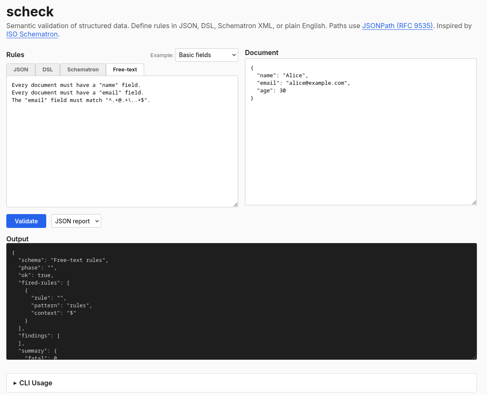

# **scheck**

[](https://github.com/rh-jfuller/scheck/actions/workflows/ci.yml)
[](LICENSE)

Semantic validation of structured data using assertion-based rules.

[Try it in your browser](https://rh-jfuller.github.io/scheck/) -- no install needed.



See the [examples](docs/examples.md) for a full walkthrough of every feature.

## Install

### Pre-built binaries

Download from [GitHub Releases](https://github.com/rh-jfuller/scheck/releases):

```
# Linux x86_64 (static musl)
curl -LO https://github.com/rh-jfuller/scheck/releases/latest/download/scheck-<version>-x86_64-unknown-linux-musl.tar.gz
tar xzf scheck-*-x86_64-unknown-linux-musl.tar.gz
sudo install scheck /usr/local/bin/

# macOS (Apple Silicon)
curl -LO https://github.com/rh-jfuller/scheck/releases/latest/download/scheck-<version>-aarch64-apple-darwin.tar.gz
tar xzf scheck-*-aarch64-apple-darwin.tar.gz
sudo install scheck /usr/local/bin/
```

### RPM

```
sudo rpm -i https://github.com/rh-jfuller/scheck/releases/latest/download/scheck-<version>-1.x86_64.rpm
```

### From source

```
cargo install scheck
```

## CLI

```
$ scheck --help
Semantic validation of structured data using assertion-based rules

Usage: scheck <COMMAND>

Commands:
  validate  Validate a document against a rule file
  check     Parse and validate a rule file (check for syntax errors)
  convert   Convert rules from another format to scheck JSON
  help      Print this message or the help of the given subcommand(s)

Options:
  -h, --help     Print help
  -V, --version  Print version
```

### scheck validate

```
$ scheck validate --help
Validate a document against a rule file

Usage: scheck validate [OPTIONS] --rules <RULES> <DOCUMENT>

Arguments:
  <DOCUMENT>  Document to validate (JSON or YAML)

Options:
  -r, --rules <RULES>              Rule file (.scheck, .json, .xml, or .txt)
      --rule-format <RULE_FORMAT>  Rule format (auto-detected from extension if omitted)
                                   [possible values: dsl, json, schematron, freetext]
  -p, --phase <PHASE>              Phase to activate (default: schema's `default_phase`)
  -c, --context <CONTEXT>          Validate only a document subtree at given path
  -f, --format <FORMAT>            Output format [default: text] [possible values: text, json]
  -h, --help                       Print help
```

### scheck check

```
$ scheck check --help
Parse and validate a rule file (check for syntax errors)

Usage: scheck check [OPTIONS] <RULES>

Arguments:
  <RULES>  Rule file to validate

Options:
      --rule-format <RULE_FORMAT>  Rule format (auto-detected from extension if omitted)
                                   [possible values: dsl, json, schematron, freetext]
  -h, --help                       Print help
```

### scheck convert

```
$ scheck convert --help
Convert rules from another format to scheck JSON

Usage: scheck convert --from <FROM> <INPUT>

Arguments:
  <INPUT>  Input rule file to convert

Options:
      --from <FROM>  Source format [possible values: spectral]
  -h, --help         Print help
```

### Environment variables

| Variable | Default | Description |
|----------|---------|-------------|
| `SCHECK_MAX_FILE_SIZE` | `10485760` (10 MiB) | Maximum input file size in bytes for both rule files and documents |

## Why scheck?

Schema validation only brings you so far.

JSON Schema, XML Schema, YAML validators -- they tell you whether a document is
*structurally* correct. The right types in the right places. But they cannot tell
you whether the data makes *sense*.

Real-world data has constraints that cut across structure - security data for example:

- A vulnerability advisory **must** contain a CVE ID, and that ID **must** match `CVE-YYYY-NNNNN+`.
- If a remediation references a vulnerability, that vulnerability **must** exist in the document.
- Every product in a branch **must** have at least one version range.
- A `status` field set to `"final"` **must not** coexist with an empty `release_date`.
- An SBOM **must** contain at least one package with a valid PURL.

These are **semantic rules** -- co-occurrence constraints, cross-reference checks,
conditional requirements, cardinality bounds. No schema language can express them.
You end up writing bespoke validation code, scattered across your codebase, with
inconsistent error messages and no way to share rules across teams.

scheck lets you define semantic assertions as rules -- in JSON, in Rust, or in a
lightweight DSL -- then run them against any JSON or YAML document. Rules are data.
Any language can generate them, any tool can read them.

Path expressions use [JSONPath (RFC 9535)](https://www.rfc-editor.org/rfc/rfc9535),
the standardized query language for JSON. No custom path syntax to learn.

scheck is inspired by [ISO Schematron](https://en.wikipedia.org/wiki/Schematron),
the rule-based validation language for XML that Rick Jelliffe described as
*"a feather duster to reach the parts other schema languages cannot reach."*

### vs JSON Schema

JSON Schema validates *structure*. scheck validates *semantics*. They are
complementary: run JSON Schema first, then scheck.

### vs Spectral / vacuum

Spectral pioneered "JSONPath + rules as data" for API linting. scheck
differs in three ways: (1) assert/report duality from Schematron --
Spectral has no notion of positive findings, (2) phases for selective
validation, (3) a typed rule model that round-trips through Rust, JSON,
DSL, and Schematron XML. If you already have Spectral rules,
`scheck convert` translates them.

### vs conftest / Rego

Rego is a policy language -- expressive but requires learning a new syntax.
scheck rules are *data*: JSON that any language can generate and
non-developers can review. The tradeoff is expressiveness for portability.
If your checks need loops or aggregation, use Rego. If they need to be
reviewed by a compliance team, use scheck.

### vs format-specific validators

Format validators like `csaf-rs` implement specs exhaustively. scheck does
not replace them. scheck handles the checks *you* add on top:
organizational conventions, ingestion invariants, cross-document coherence.

## Rulesets

### Writing rules as JSON

The primary rule format is JSON. Every scheck schema serializes cleanly:

```json
{
  "title": "CSAF Advisory Checks",
  "patterns": [
    {
      "name": "required-fields",
      "title": "Core fields must be present",
      "rules": [
        {
          "context": "$",
          "checks": [
            {
              "kind": "assert",
              "test": { "type": "exists", "path": "$.document" },
              "message": "Document root must contain a 'document' object"
            },
            {
              "kind": "assert",
              "test": { "type": "exists", "path": "$.vulnerabilities" },
              "message": "Advisory must contain at least one vulnerability",
              "severity": "warning"
            }
          ]
        }
      ]
    },
    {
      "name": "cve-format",
      "title": "CVE identifiers must be well-formed",
      "rules": [
        {
          "context": "$..vulnerabilities[*]",
          "checks": [
            {
              "kind": "assert",
              "test": {
                "type": "matches",
                "path": "$.cve",
                "pattern": "^CVE-\\d{4}-\\d{4,}$"
              },
              "message": "CVE ID must match standard format"
            }
          ]
        }
      ]
    }
  ]
}
```

```
$ scheck validate advisory.json --rules csaf-checks.json
```

Or from any language -- generate the JSON, call scheck.

### Building rules in Rust

For Rust projects, the builder API gives you type-checked rule construction
with no parsing at all:

```rust
use scheck::builder::*;
use scheck::{Severity, validate_json};

let schema = schema("CSAF Checks")
    .pattern("required-fields", |p| p
        .title("Core fields must be present")
        .rule("$", |r| r
            .assert(exists("$.document"), "must have document")
            .assert(is_email("$.contact"), "invalid contact email")
            .assert_with(
                exists("$.vulnerabilities"),
                "must have vulnerabilities",
                Severity::Warning,
            )
        )
    )
    .build();

// Validate directly
let report = validate_json(&schema, &json_string)?;
assert!(report.is_ok());

// Or serialize to JSON for sharing
let rules_json = serde_json::to_string_pretty(&schema)?;
```

The schema round-trips through JSON. Build in Rust, export as JSON for other
tools. Import JSON, validate in Rust.

### Converting Spectral rulesets

Convert existing [Spectral](https://stoplight.io/spectral) rulesets to scheck
JSON (one-shot, no runtime dependency):

```
$ scheck convert spectral-rules.yaml --from spectral > rules.json
```

Rules using `truthy`, `pattern`, `length`, and `undefined` convert directly.
Rules using custom JS functions are skipped with a comment. The output is a
standard scheck JSON ruleset you can edit, extend, and validate with.

### Starter rulesets

scheck ships with starter rulesets under [`rulesets/`](rulesets/) for
common organizational policy checks. These complement format-specific
validators (like `csaf-rs` or `cyclonedx-bom`) rather than replacing them:

| Domain | Directory | Rulesets |
|--------|-----------|----------|
| [Security](rulesets/security/) | `rulesets/security/` | CSAF 2.0, CycloneDX, SPDX, VEX, OSV |
| [API](rulesets/api/) | `rulesets/api/` | REST response contracts, JSON:API |
| [Config](rulesets/config/) | `rulesets/config/` | Kubernetes pod policy, GitHub Actions |
| [Data Quality](rulesets/data-quality/) | `rulesets/data-quality/` | Contact records, dataset metadata |

```
$ scheck validate advisory.json --rules rulesets/security/csaf-2.0-mandatory.json --phase full
$ scheck validate response.json --rules rulesets/api/jsonapi.json
$ scheck validate pod.yaml --rules rulesets/config/kubernetes-pod.json
$ scheck validate contacts.json --rules rulesets/data-quality/contact-records.json
```

See [`rulesets/README.md`](rulesets/README.md) for the full catalog. Each
subdirectory has its own README with details, phases, and limitations.

## Key concepts

### Assert vs Report

Borrowed directly from Schematron. Two kinds of checks:

- **`assert`** -- the test *must* be true. If it fails, emit the message as a failure.
- **`report`** -- if the test *is* true, emit the message as a positive finding.

Assert catches problems. Report surfaces facts.

### Phases

Group patterns into named sets and run only what matters:

```json
{
  "title": "checks",
  "default_phase": "quick",
  "phases": [
    { "name": "quick", "active_patterns": ["required-fields"] },
    { "name": "full", "active_patterns": ["required-fields", "cve-format"] }
  ],
  "patterns": [ ]
}
```

```
$ scheck validate doc.json --rules checks.json --phase full
```

### Diagnostics

Reusable explanations referenced by ID:

```json
{
  "diagnostics": [
    { "id": "spec-4.2", "message": "See CSAF 2.0 spec, section 4.2" }
  ]
}
```

### Severity and flags

Every check carries a severity (`fatal`, `error`, `warning`, `info`) and an
optional `flag` for categorization.

### Partial validation

Validate only a subtree of a document with `--context`:

```
$ scheck validate doc.json --rules rules.json --context '$.vulnerabilities[*]'
```

Rules run against each node matched by the context path instead of the full document root.

### Validated proof wrapper

For Rust library users, `Validated` guarantees at the type level that a
document passed all checks:

```rust
use scheck::try_validate;
let doc = scheck::from_json(r#"{"name": "Alice"}"#)?;
match try_validate(&schema, doc) {
    Ok(validated) => {
        let doc = validated.document(); // proven valid
    }
    Err(failed) => {
        eprintln!("{}", failed.report().to_text());
    }
}
```

## Reference

### Path expressions (JSONPath)

scheck uses [JSONPath (RFC 9535)](https://www.rfc-editor.org/rfc/rfc9535):

| Syntax | Meaning |
|--------|---------|
| `$` | Root of the document |
| `$.child` | Direct child named "child" |
| `$..name` | Recursive descent -- any descendant named "name" |
| `$.items[*]` | All elements of an array |
| `$.items[0]` | First element of an array |
| `$..book[?@.price < 10]` | Filter expression |

### Predicates

| Predicate | Meaning |
|-----------|---------|
| `exists` | Node at path exists |
| `not_exists` | Node at path must not exist |
| `equals` | Scalar at path equals value |
| `matches` | Scalar at path matches regex |
| `count` | Count of nodes satisfies comparison |
| `named` | Value matches a built-in type (see below) |
| `and` | Both predicates must hold |
| `or` | At least one must hold |
| `not` | Predicate must not hold |

### Named test types

Built-in validators for common formats, usable as `{"type": "named", "name": "<type>", "path": "..."}`:

| Name | Matches |
|------|---------|
| `email` | Email address (`user@host.tld`) |
| `url` | HTTP(S) URL |
| `cve_id` / `cve-id` | CVE identifier (`CVE-YYYY-NNNNN+`) |
| `purl` | Package URL (`pkg:type/name`) |
| `cpe` | CPE identifier (v2.2/v2.3) |
| `semver` | Semantic version (`X.Y.Z`, with optional pre-release/build) |
| `uuid` | UUID (`xxxxxxxx-xxxx-xxxx-xxxx-xxxxxxxxxxxx`) |
| `iso_date` / `iso-date` | ISO 8601 date (`YYYY-MM-DD`) |
| `iso_datetime` / `iso-datetime` | ISO 8601 datetime (`YYYY-MM-DDThh:mm:ss`) |

### Output

- **text** (default) -- human-readable, one line per finding
- **json** -- structured SVRL-inspired report with `fired-rules`, `failed-assert`, `successful-report`

## As a library

```rust
use scheck::builder::*;

// Builder API with named types
let schema = schema("example")
    .pattern("p", |p| p
        .rule("$", |r| r
            .assert(exists("$.name"), "name required")
            .assert(is_email("$.email"), "invalid email")
            .assert(is_semver("$.version"), "invalid version")
        )
    )
    .build();
let report = scheck::validate_json(&schema, r#"{"name": "Alice"}"#)?;

// Or load JSON rules directly
let report = scheck::check_json(rules_json, doc_json)?;
```

## License

[MIT](LICENSE)
